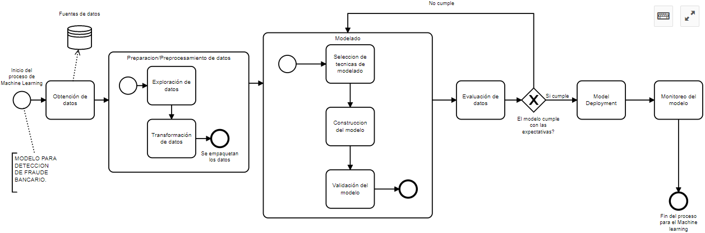
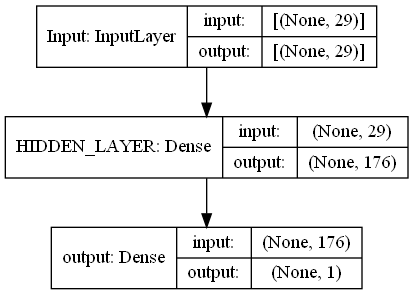

# Modelo para la deteccion de Fraude de transacciones bancarias usando Deep Learning

* [**Paper completo del proyecto. Aquí 👀📚**](https://drive.google.com/file/d/1rQomklCfWuBcIzAFqs3Pj-GC2qMfhevv/view?usp=sharing)

Repositorio con la deteccion de fraude con un **99% de precision y 99% de Recall**

* Se usó la metodologia de ciencia de datos

* El proyecto busca detectar las transacciones fraudulentas a traves de la competicion de varios modelos de Deep Learning basados en el balanceo de muestras.
* El autor no se responsabiliza del uso que se pueda dar a los datos predecidos debido a que se bassa en estimaciones

### Herramientas utilizadas

Estas fueron:

* Tensorflow
* Keras
* Scikit-Learn
* Matplotlib
* Pandas
* Numpy

Y la herramienta mas importante de todas **Keras Tuner**, un excelente sintonizador de modelos

### Acerca del Modelo de Deep Learning
* Aplicacion de redes con capas densas: Multilayer Perceptron

### El autor:
* Johan Valerio Mitma, 20 años UNMSM- Perú
* IG: https://www.instagram.com/johan_mitma12/
* Twt: https://twitter.com/JohanMitma12
